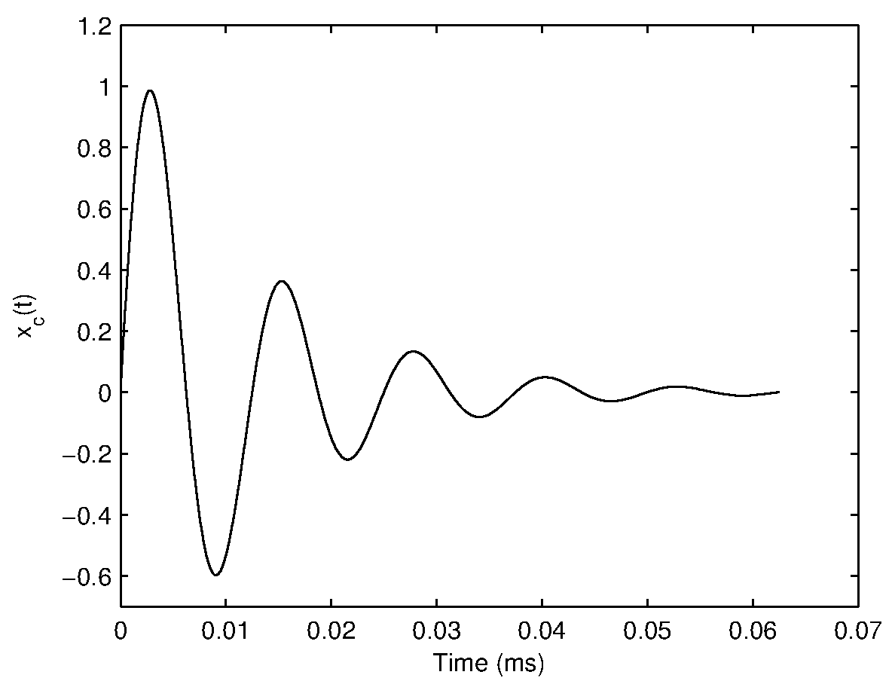
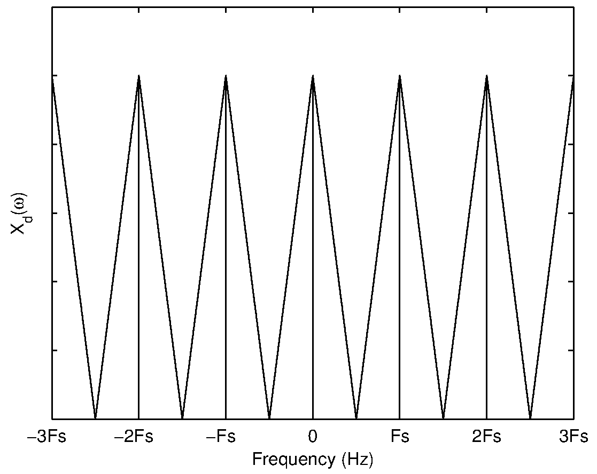
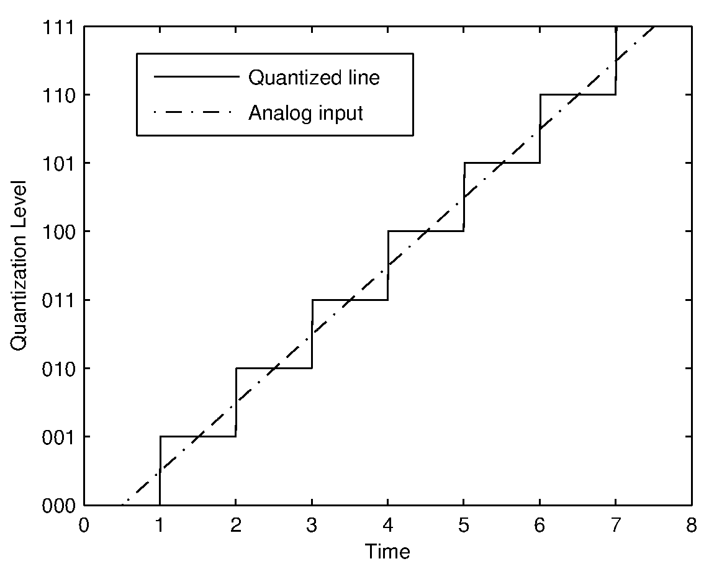
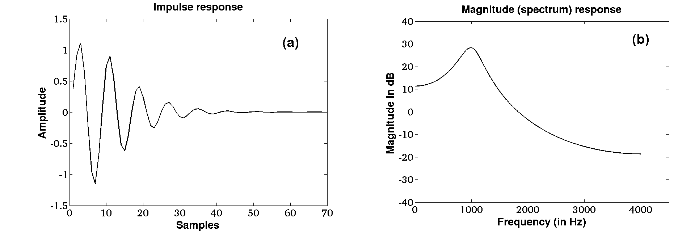
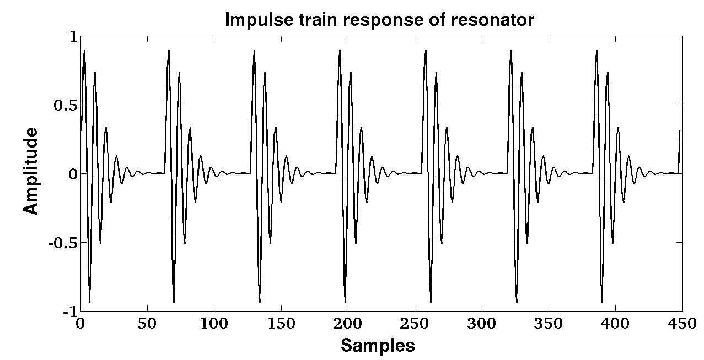

Discretization of a continuous-time signal (sampling and aliasing)

Consider a continous-time signal \(x_c(t)\) whose Fourier transform is \(X_c(\Omega)\). Then $$ x_c(t)=\frac{1}{2\pi}\int\limits_{-\infty}^{\infty} X_c(\Omega) e^{j \Omega t} d\Omega \qquad(1)$$ and $$ X_c(\Omega)=\int\limits_{-\infty}^{\infty} x_c(t) e^{-j \Omega t} dt \qquad(2)$$ A discrete-time signal \(x_d(n)\) can be obtained by uniformly sampling the continuous-time signal \(x_c(t)\) at discrete intervals \(nT\) where T is called the sampling period and n is an integer. Consider a unit impulse function \(\delta(t)\), whose value is \(1\) at \(t=0\) and \(0\) elsewhere. Then the unit impulse sequence can be expressed as $$ s(t) = \sum\limits_{n=-\infty}^{\infty} \delta(t-nT), \qquad(3) $$ and \(x_d(n)\) can be expressed as \begin{eqnarray} x_d(n) & = & x_c(t) s(t) \qquad(4) \\ & = & x_c(t) \sum\limits_{n=-\infty}^{\infty} \delta(t-nT) \qquad(5)\\ & = & \sum\limits_{n=-\infty}^{\infty} x_c(nT) \delta(t-nT). \qquad(6) \end{eqnarray}
 
  
 

Signal 	Impulse train
(a)
	
(b)
Sampling 	Sampled Signal
(c)
	
(d)
Figure 1: (a) Damped sinusoid, (b) Impulse train, (c) Illustration of sampling and (d) Sampled signal.

Figure 1 illustrates the process and effect of sampling a continuous-time signal in the time domain. In the frequency domain, the corresponding Fourier transform of \(x_d(n)\) can be obtained by convolving the individual Fourier transforms of \(x_c(t)\) and \(s(t)\). This is because multiplication of two sequences in the time domain is equivalent to convolution in the Fourier domain. Similarly multiplication in the Fourier domain is equivalent of convolution in the time domain.

To observe the effect of sampling in the frequency domain, we need to consider the Fourier Transform of \(s(t)\). Since \(s(t)\) is periodic with period T, using Fourier series expansion it can be shown that $$ s(t) = \frac{1}{T}\sum\limits_{k=-\infty}^{\infty} e^{-j k \Omega_s t}, \qquad(7) $$ where \(\Omega_s=\frac{2\pi}{T}\) is the sampling frequency.

Now the Fourier transform of \(s(t)\) may be computed as \begin{eqnarray} S(\Omega) & = & \int\limits_{-\infty}^{\infty} s(t) e^{-j \Omega t} dt \qquad(8)\\ & = & \int\limits_{-\infty}^{\infty} \frac{1}{T}\sum\limits_{k=-\infty}^{\infty} e^{-j k \Omega_s t} e^{-j \Omega t} dt \qquad(9)\\ & = & \frac{2\pi}{T} \sum\limits_{k=-\infty}^{\infty} \delta(\Omega - k \Omega_s). \qquad(10) \end{eqnarray}

Thus the Fourier transform of an impulse train with period \(T\) is another impulse train with period \(\Omega_s = \frac{2\pi}{T}\). To illustrate the effect of sampling in the frequency domain, consider some arbitrary Fouirer transform of a signal with bandwidth \(B\) shown in Figure 2(a). The Fourier transform of the impulse train sequence with period \(T\) is shown in Figure 2(b) where \(F_s=\frac{1}{T}\) denotes the sampling frequency. The corresponding discrete-time Fourier transform of the sampled signal is shown in Figure 2(c) for the case where \(F_s \gt 2B\). If the sampling frequency is reduced (\(F_s \lt 2B \)), the resultant discrete-time Fourier transform (shown in Figure 2(d)) clearly indicates the overlapping of spectral components. This effect is called aliasing and is due to an insufficient sampling rate. If the signal is sampled at a sampling frequency of \(F_s = 2B\), then no spectral distortion occurs as can be seen from (shown in Figure 3). Hence the minimum sampling frequency required to discretize a signal without aliasing is equivalent to twice the bandwidth of the signal. This frequency is referred to as the Nyquist rate.
Signal FT 	Impulse train FT
(a)
	
(b)
Oversampled 	Undersampled
(c)
	
(d)
 
  
 

Figure 2: Fourier transform of (a) Bandlimited signal and (b) Impulse train. Discrete time Fourier transform of (c) Oversampled signal (\(Fs>2B\)) (d) Undersampled signal (\(Fs \lt 2B\)).
Nyquist
 
  
 

Figure 3: Discrete time Fourier transform of signal sampled at Nyquist frequency (\(Fs=2B\)).

Digitization of a discrete-time signal - Quantization and quantization error

A discrete-time signal obtained through sampling is still a continuous amplitude time sequence, where each sample value has an infinite precision. But digital computers are finite precision machines and hence there is a need to discretize and limit the range of sample values. This is achieved by quantization (more accurately scalar quantization). In the quantization process, each sampled value of a discrete-time signal is compared against a finite set of amplitude values and assigned a value in the set that is closest to the discrete-time value. The number of elements in the finite set is determined by the precision of the digital system. In an 8-bit system, there are \(2^8 =256\) elements in the set. The number of elements in the the finite set is referred as the number of quantization levels. If the difference in values of adjacent elements in the ordered set is constant, then the quantizer is referred as an uniform linear quantizer. Figure 4 shows the effect of quantizing a line using a 3-bit quantizer.
Quantizer
 
  
 

Figure 4: Quantization of a linear segment of an analog signal.

Since the digital signal is obtained by quantizing the continuous valued discrete-time signal, there is an error introduced in representation of the signal. If the discrete-time signal \(x_d(n)\) has a limited amplitude range i.e., \(|x_d(n)|\leq A_\mbox{max}\), the quantization step for a B-bit uniform quantizer is given by $$ Q_s = \frac{2A_{max}}{2^B} \qquad(11) $$ The maximum quantization error introduced by a B-bit uniform quantizer is given by \begin{eqnarray} Q_{e_{max}} & = & \frac{Q_s}{2} \qquad(12)\\ Q_{e_{max}} & = & \frac{A_\mbox{max}}{2^B} \qquad(13) \end{eqnarray} Hence the quantization error for each sample \(e(n)\) is defined as $$ e(n) = x_d(n)-x_D(n), \qquad(14) $$ where \(x_d(n)\) is the discrete-time infinite precision sampled value of the continuous-time signal \(x(t)\), and \(x_D(n)\) is the finite precision digitized (sampled and quantized) sample value. The quantization error at each sample lies within the range $$ -Q_{e_{max}} \leq e(n) \leq Q_{e_{max}}. \qquad (15) $$
Design of resonator

A resonator is an all-pole system. The transfer function of an all-pole system \(H(z)\) is given by $$ H(z) = \frac{1}{1+\sum^{N}_{k=1}{{a_k z^{-k}}}}, \qquad (16) $$ where \(\{a_k\}\)s denote the real coefficients of the denominator polynomial of order \(N\). Roots of the denominator polynomial in \(z^{-1}\) give real or complex poles. Real roots correspond to zero frequency or \(F_s/2\). Complex roots of a polynomial with real coefficients always occur in complex conjugate pairs corresponding to a frequency related to the angle of the complex root. Each pair of complex conjugate roots (or poles) corresponds to a second order polynomial which may be denoted as $$ H(z) = \frac{1}{(1-z_iz^{-1})(1-z_i^*z^{-1})} = \frac{1}{1+a_{i_1}z^{-1}+a_{i_2}z^{-2}}, \qquad (17)$$ where the complex root \(z_i\) is given by $$ z_i=r_i e^{j2\pi\frac{F_i}{F_s}}, \qquad (18) $$ where \(F_i\) denotes the resonance frequency of the second order system, and \(r_i\) corresponds to the resonance bandwidth \(B_i\) given by $$ r_i=e^{-\pi B_i T}, \qquad (19) $$ where \(T\) denotes the sampling interval. By using Eq. 18 and Eq. 19, Eq. 17 can be derived as $$ H_i(z) = \frac{1}{1 - 2 e^{(-\pi B_i T)} cos(2 \pi F_i T) z^{-1} + e^{(-2 \pi B_i T)} z^{-2}}, \qquad (20) $$ where \(F_s = \frac{1}{T}\) represents the sampling frequency.

For example, the magnitude response of an all-pole system \(H(z)\) with resonant frequency \(F_i\) = 1000 Hz,\(B_i\) = 100 Hz and \(F_s\) = 8000 Hz is shown in Figure 5. The impulse response is a samped sinusoidal signal. The damping depends on the bandwidth of the pole of the system.
Quantizer
 
  
 

Figure 5: Impulse response and magnitude response.

Consider a train of impulse sequence, \(I(nT_0)\), with each impulse located at integer multiples of \(T_0\) (\(T_0 \gt\gt T\)) as shown in Figure 6. The output resonance of the system \(O(nT)\) is shown in Figure 7. The output signal is periodic with fundamental period (\(T_0\)) (from which the fundamental frequency is obtained as \(F_0 = \frac{1}{T_0}\)) is shown in Figure 7.
Quantizer
 
  
 

Figure 6: Train of impulse sequence.
Quantizer
 
  
 

Figure 7: Output resonance of the system.

